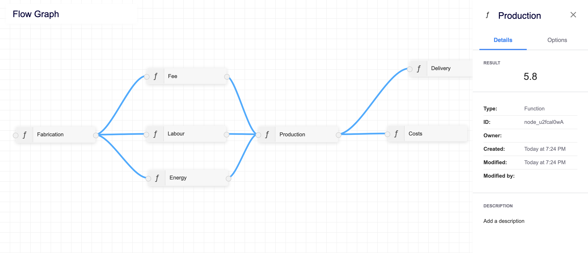

# flow-graph

Flow graph editor using VueJS and [BaklavaJs](https://github.com/newcat/baklavajs).



## Features

* Easy-to-use editor which provides the ability to create custom nodes.
* Create and connect nodes to make calculations based on excel and mathematical [formulas](https://formulajs.info/functions/).
* Dynamic flow graph update.
* Relationship auto-orientation.
* Zoom and pan.
* Written in TypeScript.

## Project setup

Clone the repository, install all dependencies, build and serve the project.

```bash
> git clone https://github.com/Degooya/flow-graph.git
> npm install
> npm run serve
```

Open `http://localhost:8080` in your favorite browser.


### Compiles and minifies for production
```
npm run build
```

### Run your unit tests
```
npm run test:unit
```

## Usage

To create a node, right-click on the checkered area and chose from different node types. Connect a node to an output node to start the calculation. To add values, click on a node to open the sidebar, open the options tab, and add a value to the node. 

**Function nodes** allow the usage of excel and mathematical [formulas](https://formulajs.info/functions/). To calculate connected nodes, enter their node-id in the formula field. Please also see [formula-parser](https://github.com/handsontable/formula-parser).

```javascript
(1 + sum(node_O_abmEqQ5, node_axqoBOu0O) + (5 * 10)) / 10
```

## Copyright and license

Copyright (C) 2021. Code released under the [GNU General Public License](LICENSE).
